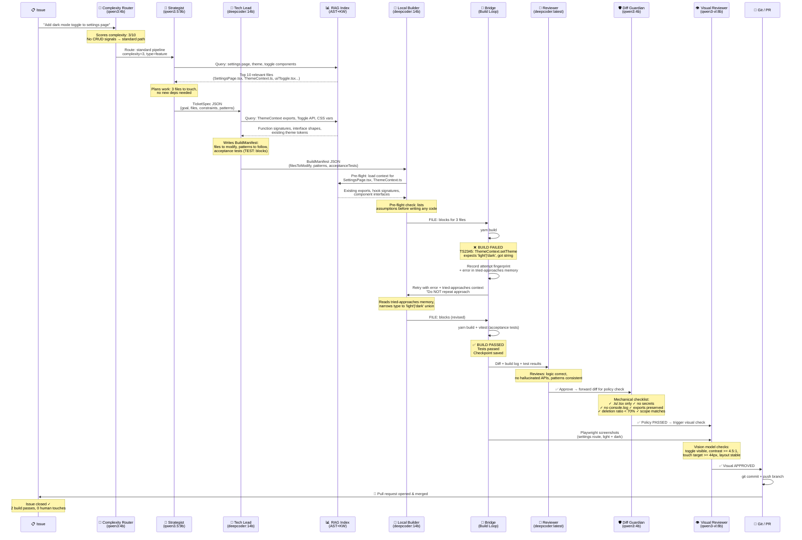

```
     ██████╗██╗      ██████╗ ███████╗███████╗██████╗ ██╗      ██████╗  ██████╗ ██████╗
    ██╔════╝██║     ██╔═══██╗██╔════╝██╔════╝██╔══██╗██║     ██╔═══██╗██╔═══██╗██╔══██╗
    ██║     ██║     ██║   ██║███████╗█████╗  ██║  ██║██║     ██║   ██║██║   ██║██████╔╝
    ██║     ██║     ██║   ██║╚════██║██╔══╝  ██║  ██║██║     ██║   ██║██║   ██║██╔═══╝
    ╚██████╗███████╗╚██████╔╝███████║███████║██████╔╝███████╗╚██████╔╝╚██████╔╝██║
     ╚═════╝╚══════╝ ╚═════╝ ╚══════╝╚══════╝╚═════╝ ╚══════╝ ╚═════╝  ╚═════╝ ╚═╝
```

<p align="center">
  <strong>⚠️ Local AI agents are dumb. They hallucinate, break code, and get stuck in loops.</strong>
</p>

<p align="center">
  <em>ClosedLoop fixes this with orchestration — making 14B models outperform 70B models<br/>through RAG, capped local loops, reflection memory, and <strong>automated epic-level build review</strong>.<br/>Runs on your GPU. No API bills.</em>
</p>

<p align="center">
  <a href="#-quick-start">⚡ Quick Start</a> &bull;
  <a href="#-how-it-works">🔄 How It Works</a> &bull;
  <a href="#-key-features">✨ Key Features</a> &bull;
  <a href="#-cost-comparison">📊 Cost Comparison</a>
</p>

---

## 💡 The Problem

You've tried local AI coding. You know the pain:

- ❌ **Hallucinates imports** — generates code for APIs that don't exist
- ❌ **Breaks existing code** — deletes exports, ignores your patterns
- ❌ **Spins in circles** — tries the same broken fix 5 times
- ❌ **Can't handle multi-file work** — loses context across files

**This isn't the model's fault. It's the workflow.**

ClosedLoop is an **orchestration layer** that makes small local models produce production-quality results. Think of it as the difference between giving a junior dev a task and giving them a task *plus* a tech lead, code review, CI/CD, and institutional memory.

**🧠 Orchestration > Model Size. The system is the product.**

---

## 🎯 Who Is This For

- 💻 **Solo devs** who want continuous AI development without $300/month API bills
- 🔒 **Privacy-conscious teams** who can't send proprietary code to cloud APIs
- 🔧 **Tinkerers** who want to push local LLMs beyond what a single Ollama call can do
- 🖥️ **Anyone with a decent GPU** (16GB+ VRAM) who wants hands-free issue-to-PR automation

---

## 📊 Cost Comparison

| Approach | Monthly Cost | Privacy | Offline | Unlimited |
|----------|-------------|---------|---------|-----------|
| GPT-4 API | $50-500+ | ❌ Code sent to OpenAI | ❌ | ❌ Rate limited |
| Claude API | $50-300+ | ❌ Code sent to Anthropic | ❌ | ❌ Rate limited |
| GitHub Copilot | $19/user | ❌ Code sent to GitHub | ❌ | ⚠️ Fair use limits |
| Cursor Pro | $20/user | ❌ Code sent to cloud | ❌ | ⚠️ Fast request limits |
| **ClosedLoop** | **~$0** | ✅ **Fully local** | ✅ **Yes** | ✅ **Unlimited** |

*💰 One-time cost: a GPU that can run 14B+ models (RTX 3060 12GB ~$200 used, RTX 4060 Ti 16GB ~$400).*
*🆘 Optional: Remote rescue (GLM-5 via z.ai) is pay-per-use for when local models get stuck — most tasks complete without it.*

---

## 🔄 How It Works

ClosedLoop orchestrates **9 specialized AI agents** running locally via [Ollama](https://ollama.ai). Each agent runs a right-sized model — small models for routing, bigger models for code generation. A ticket enters, a PR comes out. **Zero human intervention.**



### 🏗️ The Pipeline

```
  📋 Issue Created
       │
       ▼
  ┌─────────────────┐
  │ 🧭 Complexity   │──── Simple task?    ──▶ Strategist (local pipeline)
  │    Router (4B)   │──── Greenfield app? ──▶ Remote Architect (GLM-5, optional)
  └────────┬────────┘──── CRUD entity?    ──▶ Scaffold Engine (zero-shot, no LLM)
           │
           ▼
  🧠 Strategist (9B) ──▶ 📐 Tech Lead (14B) ──▶ 🔨 Local Builder (14B)
                                                        │
                                    RAG Context + Reflection Memory
                                                        │
                     ┌──────────────────────────────────┤
                     │     🔁 Build Loop (up to 20 passes)
                     ▼                                  ▼
  📝 Reviewer (19B) ──▶ 🛡️ Diff Guardian (4B) ──▶ 👁️ Visual Reviewer (8B)
                                                        │
                                                        ▼
                                                 🎉 PR Created & Merged
```

### 🤖 The Agent Team

Each agent runs a different local model, sized to its job:

| Agent | Role | Model | Size |
|-------|------|-------|------|
| 🧭 **Complexity Router** | Classifies issues, picks pipeline path | `qwen3:4b` | 2.5GB |
| 🧠 **Strategist** | CTO — analyzes, plans, decomposes | `qwen3.5:9b` | 6.6GB |
| 📐 **Tech Lead** | Architect — specs, file lists, patterns | `deepcoder:14b` | 9GB |
| 🔨 **Local Builder** | Engineer — writes actual code | `deepcoder:14b` | 9GB |
| 📝 **Reviewer** | Acceptance validator — approve/reject | `deepcoder:latest` | 9GB |
| 🛡️ **Diff Guardian** | Policy enforcer — mechanical checklist | `qwen3:4b` | 2.5GB |
| 👁️ **Visual Reviewer** | UI/UX auditor — screenshot analysis | `qwen3-vl:8b` | 5GB |
| 🔐 **Sentinel** | DevOps — CI/CD, security scans | `deepseek-r1:8b` | 5GB |
| 🚀 **Deployer** | Infrastructure — deployment execution | `qwen3:8b` | 5GB |
| 🧐 **Epic Reviewer** | Cross-epic consistency — reviews ALL epics at once, applies fixes | `glm-5` (z.ai) | Remote |
| 📋 **Epic Decoder** | Epic decomposition — breaks down complex goals into tickets | `glm-5` (z.ai) | Remote |

---

## ✨ Key Features

### 🧐 Epic Reviewer Agent
> **Problem:** Per-ticket reviews miss cross-ticket inconsistencies inside an epic — type mismatches between files, missing integration points, overlapping edits, and merge conflicts.
>
> **Solution:** When all tickets in an epic are `in_review`, Epic Reviewer becomes the only automated build authority. It gets full target-project monorepo context on the first pass, all linked ticket diffs, can apply fixes directly to ticket branches, and can create a reconciliation branch when sibling tickets collide on the same files.

### 🧠 RAG-Grounded Code Generation
> **Problem:** LLMs hallucinate file paths and invent APIs that don't exist.
>
> **Solution:** Before generating any code, ClosedLoop queries an AST-enhanced index of your codebase. The builder sees the top 10 most relevant files — exports, function signatures, interface shapes — grounding every generation in reality.

### 🔁 Capped Local Loop + Epic Build Authority
> **Problem:** Builder/reviewer loops can spin when local models hallucinate or keep retrying the same bad fix.
>
> **Solution:** Ticket-level agents no longer own build success. The local bridge loop is capped at 5 passes, Reviewer hands off only to Diff Guardian or back to Local Builder, and Epic Reviewer is the only automated build-and-repair loop. Epic Reviewer is capped at 5 attempts per epic.

### 📝 Reflection Memory
> **Problem:** The reviewer rejects code for "wrong import path" on Monday. On Tuesday, the builder makes the same mistake.
>
> **Solution:** Every rejection saves a reflection to `.reflections/{component}.md`. On future builds touching those files, past feedback is injected into the prompt. The system learns from its mistakes across sessions.

### 🧭 Three-Way Complexity Router
> **Problem:** A bug fix and "build a whole app from scratch" are fundamentally different tasks, but they enter the same pipeline.
>
> **Solution:** Every issue gets a complexity score (0-10). Score < 7 + CRUD signals? Zero-shot scaffold, no LLM needed. Score < 7? Standard local pipeline. Score >= 7? Remote architect specs the work first, then decomposes into sub-tickets.

### 🛡️ Diff Guardian (Mechanical Policy Gate)
> **Problem:** The reviewer says "looks good" but the diff has `console.log` spam, deleted exports, or scope violations.
>
> **Solution:** Diff Guardian is deterministic-only. It runs an objective checklist: `.ts`/`.tsx` only, no secrets, no debug code, deletion ratio < 70%, all exports preserved, scope matches issue.

### 💬 Communicative Dehallucination
> **Problem:** The builder assumes wrong things about the codebase and generates code based on those assumptions.
>
> **Solution:** Before writing code, the builder must list which files it will modify vs. create and state its assumptions. This pre-flight check forces the model to reason about the codebase before generating, catching misunderstandings early.

### ⚠️ Import Validation with Contextual Hints
> **Problem:** Builder hallucinates packages that don't exist (`ky`, `axios`, `@mui/*`), causing build failures.
>
> **Solution:** Pre-flight import validation checks all imports against `package.json` before build. When validation fails, includes **detailed fix hints**: lists valid packages, suggests alternatives (`fetcherWithToken` instead of `ky`), and shows common valid import patterns. After 2 import failures, escalates to Reviewer.

### 🔀 Parallel Worktree Exploration
> **Problem:** For ambiguous tasks, the builder picks one approach and commits to it. If it's wrong, the whole review loop restarts.
>
> **Solution:** For complex tasks (score >= 7 or Tech Lead `[EXPLORE]` signal), ClosedLoop spawns 2-3 builder runs in separate git worktrees with different approach strategies. Each approach is isolated — no cross-contamination. Reviewer compares passing approaches and picks the best one. Cost of exploration with local models is near-zero.

<details>
<summary><strong>📋 All Features (21 total)</strong></summary>

### 🔨 Scaffold Engine (Zero-Shot CRUD)
> CRUD APIs are boilerplate. When the router detects a CRUD ticket (entity + fields + table), the Scaffold Engine generates all files deterministically in one shot — routes, service layer, Zod schemas, DB types, enum entries. No LLM needed.

### 📋 Goal/Epic Decomposition
> Issues tagged `[Goal]` or `[Epic]` (or scoring >= 7) are decomposed into narrow, buildable sub-tickets. Each gets its own issue, `.tickets/` spec, and parent tracking. The parent auto-completes when all children finish.

### 🆘 Remote Rescue (GLM-5 Fallback)
> When the same build error repeats 3+ times, ClosedLoop calls GLM-5 (via z.ai API) for a rescue fix. **100% optional** — without an API key, the system continues locally.

### 👁️ Visual Reviewer (Playwright Screenshots)
> A vision LLM (`qwen3-vl:8b`) analyzes Playwright screenshots of every route. Checks layout, color harmony, WCAG AA contrast (4.5:1), touch targets (44px+), and design system adherence.

### ⏪ Auto-Revert on Rejection
> When code is rejected, the workspace reverts to the last green checkpoint. The builder always starts fresh from known-good state.

### 💥 Burst Model Support
> First pass of a greenfield task uses `qwen3-coder:30b` (burst mode) for quality. Subsequent repair passes drop to `deepcoder:14b` for speed. Best of both worlds.

### 📐 Structured JSON Communication
> Typed JSON contracts between agents — `TicketSpec`, `BuildManifest`, `ReviewVerdict`, `DiffVerdict`. Parsers extract JSON from LLM output with keyword fallback for freeform responses.

### 🧪 Test-First Workflow
> Tech Lead defines acceptance tests (`TEST:` blocks) before the builder writes code. The builder's exit condition becomes "build passes AND tests pass."

### 🌳 AST-Based RAG Indexing
> RAG index extracts function signatures, interface shapes, enum values, and import relationships. AST matches get a 2x scoring boost, surfacing structurally relevant files first.

### 📈 Success Rate Tracking
> Every task outcome is recorded: model, complexity score, pass count, rescue needed. A threshold engine suggests raising/lowering the complexity cutoff based on real data.

### 🔀 Remote Flag Propagation
> Issues entering through the complex path carry a flag across delegation hops. When the flag reaches the Local Builder, it activates burst model override.

### 🌐 Bridge/Proxy Git Deduplication
> All git operations (branch, commit, push) go through a single `/git/sync` endpoint. One source of truth, no duplicate logic.

### 🖥️ Control Panel (closedloop.cmd)
> Windows batch script with menu-driven control — start/stop all services, check status, wake agents, view logs, build RAG index. One command to rule them all.

### 🧪 154-Test Safety Net
> Comprehensive test suite covering all pure-logic modules: utils, complexity router, scaffold engine, epic decomposer, delegation, code extractor, agent contracts, test-first, AST indexer, success tracker, worktree ops, and exploration orchestrator.

### 🔍 Build Failure Loop Detection
> Tracks consecutive build failures per issue. After 2 failures, sends to Reviewer for assistance. After 4 failures, creates PR for human intervention. Prevents infinite retry loops.

### 🎯 Import Validation with Hints
> Pre-flight import validation catches hallucinated packages before build. Provides contextual hints with valid alternatives. Escalates to Reviewer after 2 failures.

</details>

---

## ⚡ Quick Start

### Prerequisites

| Requirement | Minimum | Recommended |
|-------------|---------|-------------|
| 🖥️ **GPU VRAM** | 8GB (7B models only) | 16GB+ (run 14B-30B models) |
| 💾 **RAM** | 16GB | 32GB |
| 💿 **Storage** | 20GB for models | 50GB+ for model variety |
| 📦 **Node.js** | 18+ | 20+ |
| 🪟 **OS** | Windows 10/11 | Windows 11 |

### Installation

```bash
# 1. Clone
git clone https://github.com/jeremiahdingal/closedloop.git
cd closedloop

# 2. Install dependencies
npm install

# 3. Pull the models you need (pick based on your VRAM)
ollama pull qwen3:4b            # 🧭 Routing + Diff Guardian (2.5GB)
ollama pull qwen3.5:9b          # 🧠 Strategist (6.6GB)
ollama pull deepcoder:14b       # 📐🔨 Tech Lead + Local Builder (9GB)
ollama pull deepcoder:latest    # 📝 Reviewer (9GB)
ollama pull qwen3-vl:8b         # 👁️ Visual Reviewer (5GB)
ollama pull nomic-embed-text    # 📊 RAG embeddings (300MB)

# Optional: Remote agents (GLM-5 via z.ai) - requires Z_AI_API_KEY
# 🧐 Epic Reviewer - cross-epic consistency review
# 📋 Epic Decoder - epic decomposition

# 4. Build
npm run build

# 5. Index your codebase for RAG
npm run rag-index

# 6. Start ClosedLoop
npm start
```

### ⚙️ Configuration

Edit `.paperclip/project.json`:

```json
{
  "project": {
    "name": "Your Project",
    "workspace": "C:\\path\\to\\your\\project"
  },
  "paperclip": {
    "apiUrl": "http://127.0.0.1:3100",
    "companyId": "your-company-id",
    "agents": {
      "strategist": "agent-uuid",
      "tech lead": "agent-uuid",
      "local builder": "agent-uuid",
      "reviewer": "agent-uuid",
      "diff guardian": "agent-uuid",
      "visual reviewer": "agent-uuid",
      "complexity router": "agent-uuid",
      "epic reviewer": "agent-uuid",
      "epic decoder": "agent-uuid"
    }
  },
  "ollama": {
    "proxyPort": 3201,
    "ollamaPort": 11434,
    "models": {
      "strategist": "qwen3.5:9b",
      "tech lead": "deepcoder:14b",
      "local builder": "deepcoder:14b",
      "local builder burst": "qwen3-coder:30b",
      "reviewer": "deepcoder:latest",
      "diff guardian": "qwen3:4b",
      "visual reviewer": "qwen3-vl:8b",
      "complexity router": "qwen3:4b"
    }
  }
}
```

### 🆘 Optional: Remote Rescue (GLM-5)

For the escape-hatch when local models get stuck:

```bash
set Z_AI_API_KEY=your-zhipu-ai-key   # z.ai API key
```

**100% optional.** Without it, ClosedLoop runs fully offline — rescue just falls through to the local retry loop.

---

## 🏗️ Architecture

```
┌──────────────────────────────────────────────────────────────────────────┐
│                     🖥️ YOUR MACHINE (Consumer PC)                       │
│                                                                          │
│  ┌──────────────┐    ┌──────────────────────────────────────────────┐   │
│  │  📎 Paperclip │    │          ClosedLoop Proxy (port 3201)        │   │
│  │  AI Platform  │◄──►│                                              │   │
│  │  (port 3100)  │    │  ┌────────────┐  ┌────────────────────────┐ │   │
│  └──────────────┘    │  │ 🧠 RAG     │  │ 🔀 Delegation Engine  │ │   │
│                       │  │ (AST+KW)   │  │ (Org Chart Routing)   │ │   │
│  ┌──────────────┐    │  └────────────┘  └────────────────────────┘ │   │
│  │  🦙 Ollama   │    │  ┌────────────┐  ┌────────────────────────┐ │   │
│  │  LLM Server  │◄──►│  │ 📦 Git Ops │  │ 🏗️ Scaffold Engine    │ │   │
│  │  (port 11434) │    │  │ (Branch/PR) │  │ (Zero-Shot CRUD)      │ │   │
│  └──────────────┘    │  └────────────┘  └────────────────────────┘ │   │
│                       └──────────────────────────────────────────────┘   │
│                                                                          │
│  ┌──────────────────────────────────────────────────────────────────┐   │
│  │              🌉 Bridge Server (port 3202)                        │   │
│  │  ┌──────────────┐  ┌──────────────┐  ┌────────────────────────┐ │   │
│  │  │ 🔄 Build Loop │  │ 💾 Sessions  │  │ 🆘 Remote Rescue     │ │   │
│  │  │ (Green Gate)  │  │ (Checkpoints) │  │ (GLM-5 Fallback)     │ │   │
│  │  └──────────────┘  └──────────────┘  └────────────────────────┘ │   │
│  └──────────────────────────────────────────────────────────────────┘   │
│                                                                          │
│  ┌──────────────────────────────────────────────────────────────────┐   │
│  │                  📁 Your Project Workspace                       │   │
│  │  📄 Source Code  │  🧪 Tests  │  📊 .reflections/  │  📋 .tickets/│   │
│  └──────────────────────────────────────────────────────────────────┘   │
└──────────────────────────────────────────────────────────────────────────┘
```

---

## 🧪 Testing

```bash
npx vitest run        # Run all 154 tests
npx vitest --watch    # Watch mode during development
```

| Test Suite | Tests | What It Covers |
|------------|-------|----------------|
| `utils.test.ts` | 16 | String utils, JSON parsing, ID extraction |
| `complexity-router.test.ts` | 10 | Scoring bugs vs features vs greenfield vs epics |
| `scaffold-engine.test.ts` | 20 | CRUD generation, config detection, file patching |
| `epic-decomposer.test.ts` | 7 | Ticket parsing from markdown/numbered lists |
| `delegation.test.ts` | 7 | Org chart enforcement, remote flag propagation |
| `code-extractor.test.ts` | 9 | Package.json validation, destructive change detection |
| `agent-contracts.test.ts` | 16 | JSON contract parsing, formatting, keyword fallback |
| `test-first.test.ts` | 11 | Acceptance test spec parsing, vitest output parsing |
| `ast-indexer.test.ts` | 16 | Function/interface/enum/import AST extraction |
| `success-tracker.test.ts` | 13 | Outcome recording, model stats, threshold tuning |
| `worktree-ops.test.ts` | 2 | Git worktree path generation |
| `exploration-orchestrator.test.ts` | 18 | Approach parsing, comparison prompts, reviewer selection |

---

## 💡 Design Philosophy

1. 🏠 **Local-first, cloud-optional** — Everything runs on your machine. Remote APIs are escape hatches, not dependencies.
2. 📐 **Right-sized models** — A 4B model can route. A 14B model can code. Don't waste VRAM on tasks that don't need it.
3. ✅ **Epic build authority** — Ticket agents can move work forward without local build gating; Epic Reviewer owns automated build validation and repair.
4. 🧠 **Memory over repetition** — Tried-approaches and reflection memory prevent the same mistake twice.
5. 🛡️ **Mechanical gates over opinions** — Diff Guardian uses checklists, not subjective review. Objective, repeatable, fast.
6. 🔄 **Fail gracefully** — Remote rescue is optional. Burst mode is optional. Every feature degrades to the local baseline.

---

## 🗺️ Roadmap

See [IMPROVEMENTS.md](IMPROVEMENTS.md) for the full backlog. Highlights:

- 🧪 **Property-based testing in Diff Guardian** — Generate Hypothesis-style property tests for changed code
- 📜 **Event-sourced state** — Full audit trail, replay from any point

---

## 🤝 Contributing

ClosedLoop is open source. Contributions welcome:

1. Fork the repository
2. Create a feature branch
3. Run `npx vitest run` to verify tests pass
4. Submit a PR

---

<p align="center">
  <strong>Built for developers who believe AI should work for you — not bill you.</strong>
</p>

<p align="center">
  <sub>⭐ Star this repo if you believe local AI is the future of software development.</sub>
</p>

## License

MIT
